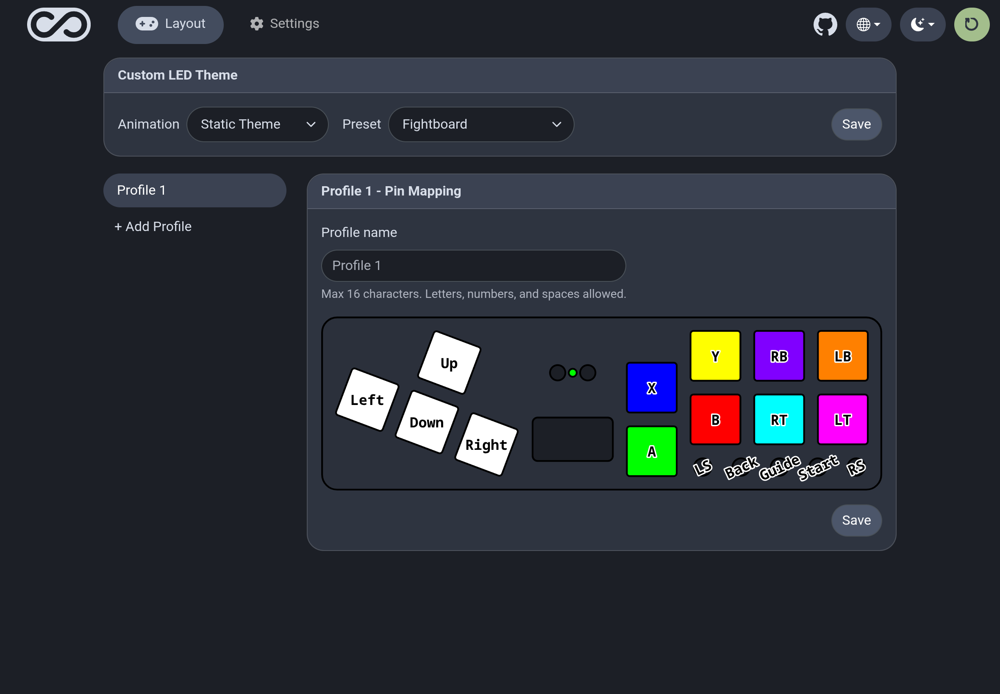
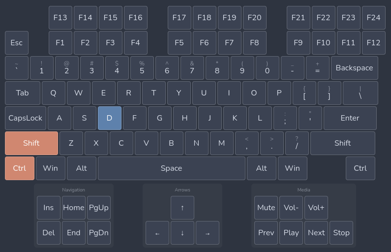

  

  Fork of <a href="https://github.com/OpenStickCommunity/GP2040-CE">GP2040-CE</a>

  
  
   
  
  

This is a fork of the original GP2040-CE as of v0.7.10. Most upstream changes are for broader compatibility, so I wanted my own fork for changes that are more specific to my controllers. Original description:

> [!NOTE]
> GP2040-CE (Community Edition) is a gamepad firmware for the Raspberry Pi Pico and other boards based on the RP2040 microcontrollers that combines multi-platform compatibility, low latency and a rich feature set to provide endless customization possibilities without sacrificing performance.
>
> GP2040-CE is compatible with PC, PS3, PS4, PS5, Nintendo Switch, Xbox One, Steam Deck, MiSTer and Android.

## New Features

  

### SVG Remapper
Instead of using pin remapping, a board SVG can be used to define pins for their positions on the board and that will be displayed on the pin remapping page of the web config instead of the list of pins. This is a lot more intuitive for remapping, since it mirrors what you see on the controller.

### Board LED addon
The Waveshare RP2040-Zero includes an on-board LED and this addon sets the color based on the input mode.

### Revamped Web Config
The web config has been streamlined for configuring a premade board rather than configuring a custom board.

### Per-profile Keyboard Mapping
Unique keyboard mapping for each profile.

### Multi-key Keyboard Mapping
Map each button to a key and multiple modifiers.

### Keyboard Widget

  

Instead of setting keys with a dropdown, you can just click on the keyboard keys you'd like to use.

## Installation

1. Download the `.uf2` firmware file for your board from the [latest release](https://github.com/thnikk/GP2040-CE/releases/latest)
2. Unplug your device
3. Enter BOOTSEL mode — hold the BOOTSEL button while plugging in (or hold S1 + S2 + Up)
4. A removable drive named `RPI-RP2` will appear — drag the `.uf2` file onto it
5. The device will disconnect automatically once flashing is complete

> If the device was previously used for other firmware, [flash nuke](tools/flash_nuke.uf2) it first to clear memory.

## Features

- Select from 13 input modes including X-Input, Nintendo Switch, Playstation 4/5, Xbox One, D-Input, and Keyboard
- Input latency average of 0.76ms in Xinput and 0.90ms for Playstation 5.
- Multiple SOCD cleaning modes - Up Priority (a.k.a. Stickless), Neutral, and Second Input Priority.
- Left and Right stick emulation via D-pad inputs as well as dedicated toggle switches.
- Dual direction via D-pad + LS/RS.
- Reversed input via a button.
- [Turbo and Turbo LED](https://gp2040-ce.info/add-ons/turbo) with selectable speed
- Per-button RGB LED support.
- PWM Player indicator LED support (XInput only).
- Multiple LED profiles support.
- Support for 128x64 monochrome I2C displays - SSD1306, SH1106, and SH1107 compatible.
- Custom startup splash screen and easy image upload via web configuration.
- Support for passive buzzer speaker (3v or 5v).
- [Built-in, embedded web configuration](https://gp2040-ce.info/web-configurator) - No download required!

Visit the [GP2040-CE Usage](https://gp2040-ce.info/usage) page for more details.

## Performance

Input latency is tested using the methodology outlined at [WydD's inputlag.science website](https://inputlag.science/controller/methodology), using the default 1000 Hz (1 ms) polling rate in the firmware. You can read more about the setup we use to conduct latency testing [HERE](https://github.com/OpenStickCommunity/Site/blob/main/latency_testing/README.md) if you are interested in testing for yourself or would just like to know more about the devices used to do the testing.

| Version | Mode    | Poll Rate | Min     | Max     | Avg     | Stdev   | % on time | %1f skip | %2f skip |
| ------- | ------- | --------- | ------- | ------- | ------- | ------- | --------- | -------- | -------- |
| v0.7.10 | Xinput  | 1 ms      | 0.45 ms | 1.28 ms | 0.76 ms | 0.24 ms | 98.48%    | 1.52%    | 0%       |
| v0.7.10 | Switch  | 1 ms      | 0.41 ms | 1.22 ms | 0.73 ms | 0.24 ms | 98.52%    | 1.48%    | 0%       |
| v0.7.10 | HID USB | 1 ms      | 0.42 ms | 1.24 ms | 0.73 ms | 0.24 ms | 98.53%    | 1.47%    | 0%       |
| v0.7.10 | PS3     | 1 ms      | 0.52 ms | 1.33 ms | 0.82 ms | 0.24 ms | 98.38%    | 1.62%    | 0%       |
| v0.7.10 | PS4     | 1 ms      | 0.55 ms | 2.38 ms | 0.91 ms | 0.31 ms | 98.19%    | 1.81%    | 0%       |
| v0.7.10 | PS5     | 1 ms      | 0.55 ms | 2.38 ms | 0.90 ms | 0.31 ms | 98.20%    | 1.80%    | 0%       |

Full results can be found in the [GP2040-CE v0.7.10 Firmware Latency Test Results](https://github.com/OpenStickCommunity/Site/raw/main/latency_testing/GP2040-CE_Firmware_Latency_Test_Results_v0.7.10.xlsx) .xlsx Sheet.

Results from v0.7.9 can be found [HERE](https://github.com/OpenStickCommunity/Site/raw/main/latency_testing/GP2040-CE_Firmware_Latency_Test_Results_v0.7.9.xlsx). Previous results can be found in the `latency_testing` folder.

## Acknowledgements

- [FeralAI](https://github.com/FeralAI) for building [GP2040](https://github.com/FeralAI/GP2040) and laying the foundation for this community project
- Ha Thach's excellent [TinyUSB library](https://github.com/hathach/tinyusb) examples
- fluffymadness's [tinyusb-xinput](https://github.com/fluffymadness/tinyusb-xinput) sample
- Kevin Boone's [blog post on using RP2040 flash memory as emulated EEPROM](https://kevinboone.me/picoflash.html)
- [bitbank2](https://github.com/bitbank2) for the [OneBitDisplay](https://github.com/bitbank2/OneBitDisplay) and [BitBang_I2C](https://github.com/bitbank2/BitBang_I2C) libraries, which were ported for use with the Pico SDK
- [arntsonl](https://github.com/arntsonl) for the amazing cleanup and feature additions that brought us to v0.5.0
- [alirin222](https://github.com/alirin222) for the awesome turbo code ([@alirin222](https://twitter.com/alirin222) on Twitter)
- [deeebug](https://github.com/deeebug) for improvements to the web-UI and fixing the PS3 home button issue
- [TheTrain](https://github.com/TheTrainGoes/GP2040-Projects) and [Fortinbra](https://github.com/Fortinbra) for helping keep our community chugging along
- [PassingLink](https://github.com/passinglink/passinglink) for the technical details and code for PS4 implementation
- [Youssef Habchi](https://youssef-habchi.com/) for allowing us to purchase a license to use Road Rage font for the project
- [tamanegitaro](https://github.com/tamanegitaro/) and [alirin222](https://github.com/alirin222) for the basis of the mini/classic controller work
- [Ryzee119](https://github.com/Ryzee119) for the wonderful [ogx360_t4](https://github.com/Ryzee119/ogx360_t4/) and xid_driver library for Original Xbox support
- [Santroller](https://github.com/Santroller/Santroller) and [GIMX](https://github.com/matlo/GIMX) for technical examples of Xbox One authentication using pass-through
